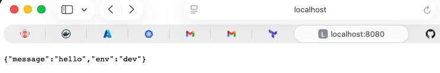
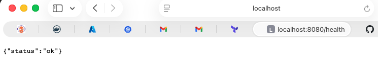
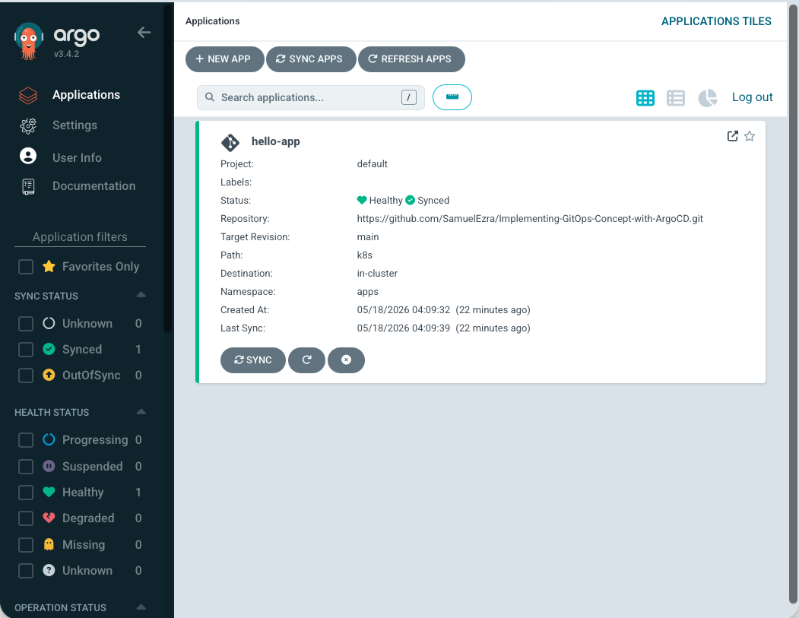

# Dojah App Implementation

## Prerequisites
- Docker
- kubectl
- kind
- Terraform

## Start Cluster
kind create cluster --name dojah-cluster

## Apply Terraform
cd terraform
alias tf=terraform   
tf init
tf plan
tf apply -auto-approve

## Build and Load Image
docker build -t hello-app:latest .
kind load docker-image hello-app:latest --name dojah-cluster

## Install ArgoCD
kubectl create ns argocd
kubectl apply -n argocd -f https://raw.githubusercontent.com/argoproj/argo-cd/stable/manifests/install.yaml

## Deploy App
kubectl apply -f argocd/application.yaml

## Access App
kubectl port-forward svc/hello-app -n apps 8080:80

## Access ArgoCD
kubectl port-forward svc/argocd-server -n argocd 8081:443

## Screenshots

